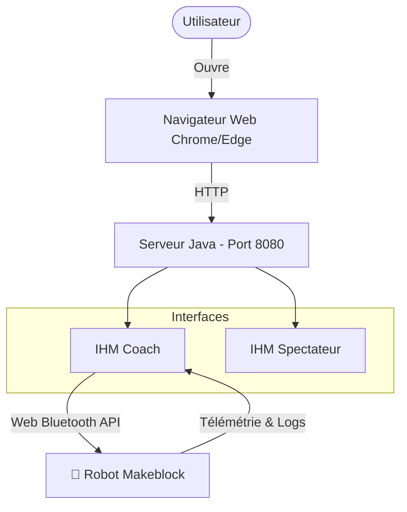

# 🏉 ROBAFIS™ – IHM Coach & Spectateur
**Concours Robafis 2025 / 2026 – CY Tech**

> **Statut** : 🟢 Actif | **Version** : 2025.1

Cette application web est le centre de contrôle pour le concours ROBAFIS™. Elle assure le **pilotage du robot Makeblock** via Bluetooth, la **gestion du score** et l’**affichage public** des informations de match.

---

## 📑 Sommaire
1. [Présentation](#-présentation)
2. [Architecture du système](#-architecture-du-système)
3. [Équipe Projet](#-équipe)
4. [Prérequis](#-prérequis)
5. [Installation & Démarrage](#-installation--démarrage)
6. [Guide d'utilisation](#-guide-dutilisation)
    - [Mode Spectateur](#-mode-spectateur)
    - [Mode Coach](#-mode-coach-ihm-entraîneur)
    - [Connexion Bluetooth](#-connexion-bluetooth-makeblock)
7. [Commandes & Protocole](#-commandes--protocole)
8. [Intégration Robot (C)](#-intégration-robot-c)
9. [Limitations & Dépannage](#-limitations--dépannage)

---

## 📌 Présentation

L'application se divise en deux interfaces :
* **IHM Entraîneur (Coach)** : Interface sécurisée pour piloter le robot, gérer les arrêts d'urgence et visualiser la télémétrie.
* **IHM Spectateur** : Affichage passif du score et des actions de jeu en temps réel.

---

## 📐 Architecture du système



---

## 👥 Équipe

* **Établissement** : CY Tech
* **Projet** : Robafis CY Tech (Concours 2025/2026)
* **Chef de projet** : Donovan Cardenas Temiquel
* **Référente** : Sonia Yassa

---

## 🧰 Prérequis

### 🔧 Matériel
- [x] Ordinateur équipé du **Bluetooth** (activé avant le lancement).
- [x] Module **Makeblock** compatible Bluetooth.
- [x] Le robot Makeblock doit être **sous tension**.

### 💻 Logiciel
- **Java 17** (Recommandé).
- Un navigateur compatible **Web Bluetooth API** :
    - ✅ **Google Chrome** (Recommandé)
    - ✅ Microsoft Edge (Chromium)
    - ❌ Mozilla Firefox (Non supporté)
    - ⚠️ Safari iOS (Nécessite configuration, voir [Dépannage](#-limitations--dépannage))

---

## 🚀 Installation & Démarrage

### 1. Construction du JAR
Si vous avez les sources, compilez le projet avec Mill :
```bash
mill server.assembly
# Fichier généré : out/server/assembly.dest/out.jar
```

### 2. Lancement du Serveur
Le fichier JAR est multiplateforme (Windows, Linux, macOS).

```bash
java -jar out.jar
```

> **⚠️ Avant de lancer :** Assurez-vous que le Bluetooth de votre PC est activé et que le robot est allumé.

---

## 📖 Guide d'utilisation

### 👀 Mode Spectateur
Accessible librement pour l'affichage public.
* **URL** : `http://localhost:8080/`
* **Affichage** : Score total et type de la dernière action (Essai, Transformation, Pénalité).

### 🎮 Mode Coach (IHM Entraîneur)
Interface de contrôle protégée.
* **URL** : `http://localhost:8080/coach`
* **Mot de passe** : `abc`

**Fonctionnalités :**
* Contrôle complet du robot (Départ, Arrêt d'urgence).
* Gestion du score.
* Visualisation du terrain (4x5) et obstacles.
* Terminal de logs (messages reçus/envoyés).

### 🔌 Connexion Bluetooth (Makeblock)

1.  Dans l'IHM Coach, cliquer sur **"Rechercher des appareils Makeblock"**.
2.  Une fenêtre navigateur s'ouvre : sélectionner le module Makeblock et cliquer sur **Associer**.
3.  Dans l'IHM, sélectionner l'appareil dans la liste déroulante.
4.  Cliquer sur **"Se connecter"**.

> **⚠️ Règles Bluetooth importantes :**
> * Plusieurs Makeblock peuvent être appairés, mais **un seul est actif** à la fois.
> * Les commandes ne sont envoyées qu'à l'appareil sélectionné dans la liste.
> * Déconnecter un appareil non sélectionné n'interrompt pas le robot en cours de match.

---

## 🎛 Commandes & Protocole

### 📊 Gestion du Score (Arbitrage)
| Bouton | Effet | Note |
| :--- | :--- | :--- |
| **+2** | Ajoute 2 points | Transformation |
| **+3** | Ajoute 3 points | Pénalité |
| **+5** | Ajoute 5 points | Essai |
| **Reset Score** | Remise à 0 du score | N'affecte pas le robot |

### 🤖 Commandes Robot (Protocole Bluetooth)
Ces codes sont envoyés par l'IHM vers le robot via le port série Bluetooth.

| Bouton IHM | Code Envoyé | Description / Effet |
| :--- | :---: | :--- |
| **Démarrer** | `"0"` | Lance le robot + **Chrono Principal** |
| **Arrêt Général** | `"1"` | Arrêt urgence + Chrono urgence (5 min) |
| **Arrêt Mécanique** | `"2"` | Arrêt urgence + Chrono urgence (5 min) |
| **Arrêt Électrique** | `"3"` | Arrêt urgence + Chrono urgence (2 min) |
| **Interruption** | `"4"` | Pause le robot |
| **Reprendre** | `"5"` | Reprise après pause ou urgence |
| **Autotest** | `"6"` | Lance l'autotest MegaPi |
| **Essai** | `"7"` | Lance la séquence "Essai" sur le robot |
| **Transformation** | `"8"` | Lance la séquence "Transformation" sur le robot |

### ⏱️ Gestion des Chronomètres
* **Chrono Principal** : Démarre avec la commande "Démarrer".
* **Chrono d'Urgence** : Démarre automatiquement lors d'un arrêt d'urgence ("1", "2" ou "3").
    * À la reprise ("5"), le chrono principal repart et le chrono d'urgence se fige.

### 🔄 Reset (Distinction)
* **Bouton Reset (Global)** : Remise à zéro totale (Chronos, obstacles, état du ballon, logs).
* **Bouton Reset Score** : Ne réinitialise que les points.

---

## 📡 Télémétrie (Robot → IHM)

Le robot peut envoyer des informations pour mettre à jour l'IHM Coach en temps réel.

### 🗺️ Terrain & Obstacles
Le terrain est une grille de 4 colonnes x 5 lignes.

| Syntaxe Message | Action sur l'IHM |
| :--- | :--- |
| `POS r c` | Met à jour la **position du robot** (Vert) en ligne `r`, colonne `c`. |
| `POS r c D` | Ajoute un **obstacle** (Jaune) en ligne `r`, colonne `c`. |
| `POS r c E` | Efface l'obstacle en ligne `r`, colonne `c`. |

### ⚽ Détection du Ballon
| Syntaxe Message | Action sur l'IHM |
| :--- | :--- |
| `Ballon 1` | Indicateur Ballon passe au **Vert** (Possession). |
| `Ballon 0` | Indicateur Ballon passe au **Rouge** (Pas de ballon). |

---

## 💻 Intégration Robot (C++)

Exemple de code pour communiquer avec l'IHM depuis un Arduino/Makeblock MegaPi.

```cpp
// Définition du port Bluetooth (ex: Serial3 sur MegaPi)
#define BT Serial3

void setup() {
    BT.begin(115200); // Vitesse bauds standard
    
    // Envoyer un message texte (log)
    BT.println(F("DEMARRAGE SYSTEME"));
}

void loop() {
    // Envoyer la position (Ligne 2, Colonne 3)
    BT.println("POS 2 3");
    
    // Envoyer un état de capteur
    int sensorValue = 42;
    BT.println(sensorValue);
    
    delay(1000);
}
```
*Toutes les données envoyées via `BT.println()` apparaissent dans le terminal de l'IHM.*

---

## ⚠️ Limitations & Dépannage

### 🌍 Compatibilité Navigateur

#### 1. Côté Spectateur (Affichage uniquement)
L'interface Spectateur fonctionne sur **tous les navigateurs modernes** (Chrome, Firefox, Edge, Safari, Opéra).

#### 2. Côté Entraîneur (Contrôle Bluetooth)
Cette interface nécessite l'API **Web Bluetooth**, qui n'est pas standardisée partout.
* ❌ **Firefox** : Non supporté.
* ✅ **Google Chrome / Edge** : Compatible. Sur Linux ou Windows ancien, voir configuration ci-dessous.

---

### ⚙️ Configuration Chrome (Flags)
Si le Bluetooth ne fonctionne pas ou n'est pas détecté, activez les options expérimentales :

1. Ouvrez un nouvel onglet Chrome et allez à l'adresse : `chrome://flags`
2. Cherchez et activez (**Enabled**) les options suivantes :

| Nom du Flag | Description | Recherche |
| :--- | :--- | :--- |
| **Web Bluetooth** | Active l'API Web Bluetooth (Indispensable sur Linux). | `#enable-web-bluetooth` |
| **New Permissions Backend** | Active le nouveau système de permissions. | `#enable-web-bluetooth-new-permissions-backend` |
| **Pairing Support** | Active le support de l'appairage par code PIN. | `#enable-web-bluetooth-confirm-pairing-support` |

3. **Redémarrez Chrome** pour appliquer les changements.

---

### 📱 Problème Safari (iOS)
Si la page reste blanche (*White Screen of Death*) sur un iPhone/iPad :
1. Ouvrir les **Réglages** de l'iPhone.
2. Aller dans **Safari** > **Avancé**.
3. Désactiver temporairement les protections de confidentialité ou activer JavaScript si désactivé.
4. Dans **Experimental Features**, vérifier que *WebGL* et *WebSockets* sont actifs.

---

### 🔌 Déconnexion
Si l'utilisateur clique sur "Se déconnecter" ou si le robot s'éteint :
* Les commandes deviennent grisées.
* L'affichage (Score, Logs) reste accessible.

> **Conseil :** Toujours déconnecter proprement via l'IHM avant d'éteindre le robot.

---
*Projet académique – Usage pédagogique et concours ROBAFIS™ uniquement.*
